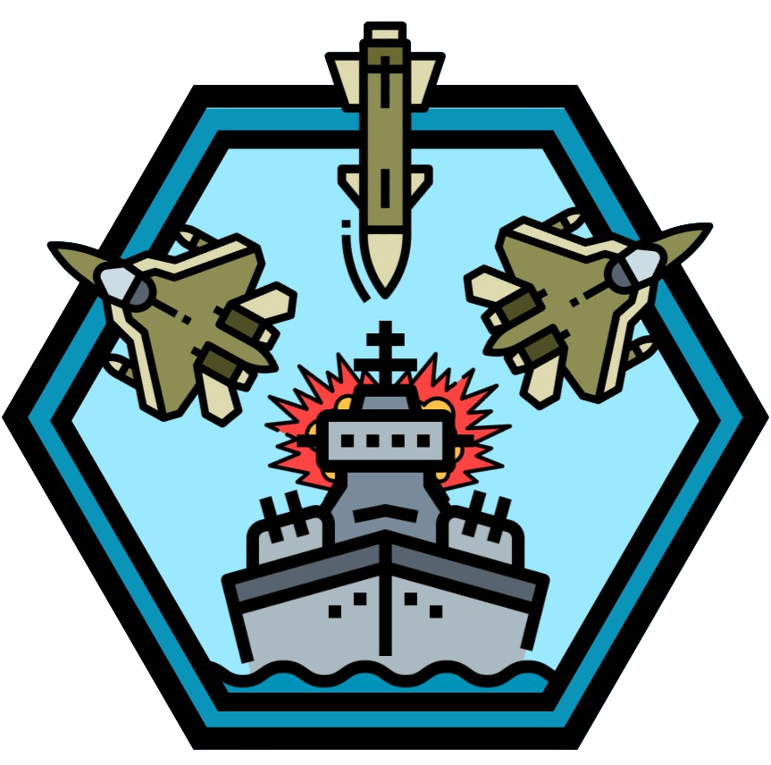

<h1 align="center">
  <br>
  <a href="http://www.amitmerchant.com/electron-markdownify"></a>
  <br>
  Airstrike Assault
  <br>
</h1>

<h4 align="center">Un jeu en Python utilisant les trajectoires.</h4>

<p align="center">
  <a>
    
    
  
  
  </a>
</p>

<p align="center">
  <a href="#Présentation-du-jeu">Présentation</a> •
  <a href="#Comment-jouer">Comment jouer</a> •
  <a href="#Télécharger">Télécharger</a> •
  <a href="#crédits">Crédits</a> •
  <a href="#license">License</a>
</p>


## Présentation du jeu

* LivePreview - Make changes, See changes
  - Instantly see what your Markdown documents look like in HTML as you create them.
* Sync Scrolling
  - While you type, LivePreview will automatically scroll to the current location you're editing.
* GitHub Flavored Markdown  
* Syntax highlighting
* [KaTeX](https://khan.github.io/KaTeX/) Support
* Dark/Light mode
* Toolbar for basic Markdown formatting
* Supports multiple cursors
* Save the Markdown preview as PDF
* Emoji support in preview :tada:
* App will keep alive in tray for quick usage
* Full screen mode
  - Write distraction free.
* Cross platform
  - Windows, macOS and Linux ready.

## Comment jouer

Pour jouer à Airstrike Assault, rien de plus simple ! Il vous suffit de suivre quelques étapes faciles :
- Assurez-vous que Python est installé sur votre machine : Avant de pouvoir exécuter notre code Python, vous devez vous assurer que le langage de programmation Python est bien installé sur votre système. Pour vérifier cela, ouvrez votre terminal préféré (l'invite de commande Windows par défaut fait l'affaire) et tapez "python --version". Si Python n'est pas déjà installé, téléchargez-le depuis le site officiel (https://www.python.org/) et suivez les instructions d'installation.
- Téléchargez ou clonez le code source : Assurez-vous d'avoir une copie du code source de notre projet sur votre ordinateur. Vous pouvez le télécharger depuis GitHub, voir : <a href="#télécharger">Télécharger</a>.
- Exécutez le code : Après avoir téléchargé et décompressé le dossier avec les éléments de notre projet, vous pouvez exécuter le code source du projet. Vous devrez chercher le fichier principal du projet, "main.py". Pour l'exécuter, vous avez plusieurs possibilités :
    - Utiliser un IDE : ouvrir le répertoire du projet dans un IDE (comme PyCharm par exemple), installer la librairie pygame, cliquer sur le fichier "main.py" et l'exécuter. Le code sera exécuté directement dans la console de votre IDE préféré.
    - Utiliser un terminal : depuis un terminal, naviguer jusqu'au répertoire du projet à l'aide de la commande "cd", puis tapez "python main.py". Le code sera exécuté directement dans votre terminal.

Commandes utilisées :

```bash
# Vérifier si python est installé sur votre machine
$ python --version

# Se déplacer dans le repertoir du projet (exemple)
$ cd Desktop\\Airstrike_Assault

# Lancer le code (si pygame est déjà installé)
$ python main.py
```

> **Note**
> Selon votre système d'exploitation ou le terminal utilisé, les commandes peuvent être différentes.


## Télécharger

Vous pouvez télécharger notre code source depuis notre page GitHub accessible via ce lien : [Télécharger](https://github.com/Adri1-rvt/Airstrike_Assault) 
<br>Pour cela, ouvrez le lien ci-dessus, puis cliquez sur le bonton vert en haut à droite de la page GitHub "Code". 
Sélectionnez ensuite "Download ZIP". 
<br>Une fois votre fichier zip téléchargé, il ne vous reste plus qu'à le décompresser (avec WinRaR par exemple) pour pouvoir utiliser le code source !


## Crédits

Ce projet a été développé par les personnes suivantes :

- Thomas BOTTALICO (thomas.bottalico@efrei.net)
- Rayane BOUSSOURA (rayane.boussoura@efrei.net)
- Alexandre BRENSKI (alexandre.brenski@efrei.net)
- Arthur HACQUES (arthur.hacques@efrei.net)
- Tess POIRAT (tess.poirat@efrei.net)
- Adrien RIVET (adrien.rivet@efrei.net)

N'hésitez pas à nous contacter par mail si vous avez besoin d'informations !